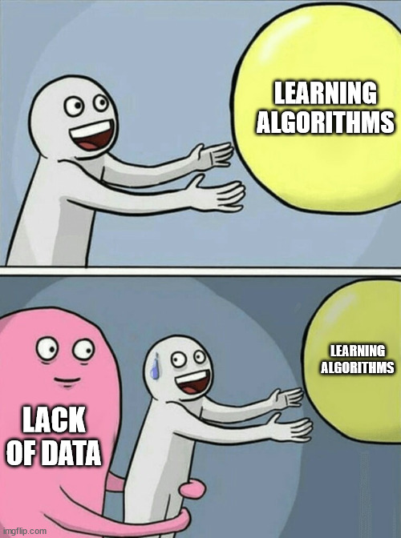
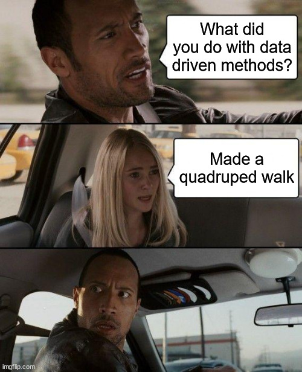
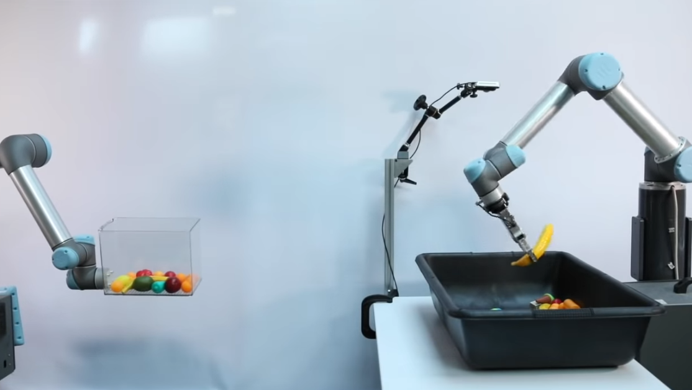

# Introduction to Robot Learning
Robot Learning is a field of Robotics where we study techniques based on learning algorithms, which help a robot in acquiring new skills and adapting to it's environment. These skills can vary from making a robotic arm move to making a quadruped walk.

By learning, what we mean here is, the robot learns what to do based on its own actions, with the help of some algorithms which we'll be covering in this specialization.

But before we jump into Robot Learning, we first need to discuss an important part of all Learning based methods - DATA.

## Data Driven Methods
In today's world, there is a large amount of data in almost every field. This data can range from images to text to statistical data. And learning algorithms use this to their benefit, to learn from the data, some patterns or anything useful which can help them do their specified tasks.
  

## What kind of Data for Robots
So you must be wondering what exactly will be the data that robots will look at? Well, since each robot is different, and the tasks that we may want to carry out can be completely different than those done before, it is difficult to have data which generalizes to each and every robot, therefore we need to collect data for each task and robot separately. And this data is in the form of robotic interactions with it's environment. E.g :- Let us say that a quadruped is trying to walk. Obviously it will be unable to do so initially, but running a large number of trials and collecting data about these trials, as to what action did the robot do, and what was the outcome after those actions. This is the kind of the data that will help in our learning algorithms.

These kind of approaches to robotics, which rely on Data, are called Data Driven Methods, as they utilize this data in order to learn new things.

 

You can check this video out to understand, what all can be done using data driven methods for robotics.

[<b>Robots Learning to Toss</b>](https://www.youtube.com/watch?v=-O-E1nFm6-A)

<b>Note: The next section requires you to have some basic knowledge about neural networks and deep learning.</b> So for those who are not familiar with these topics, we recommend you to go through the following course:
[Neural Networks and Deep Learning](https://www.coursera.org/learn/neural-networks-deep-learning)

### How is Robot Learning different from Supervised Learning?
There is always a supervisor in Supervised learning, telling what exactly is the answer for a given data point, (e.g. labels telling which image is of a dog, and which image is of a cat), and your model learns accordingly to differentiate between images of cats and dogs.

In robot learning, we don't have any such supervisor, because we actually don't know what action to take in what situation so that we will are able to achieve our task. (Also, the number of positions your robot can be in can be very large (e.g. Having 8 joints, with each having a lower limit of -pi and upper limit of pi)).

So instead of having such a supervisor, we have reward points. If the robot is able to accomplish some task, we give it reward points, so the robot is inclined towards finding a way to solve the task, and here we can have full control over the way we want to give it reward points.

However, a key concept in robot learning, is the fact that the rewards might be delayed from the perspective of the robot. That is, taking some action might not have an immediate effect and only after a large number of actions have taken place, will you be able to understand whether that action take a long time back was good or bad. In technical terms, we say that the feedback is delayed.

Due to us working with robots, which act in the real world, time and sequential nature of the problem really matters, unlike in supervised learning, where the entire data can be given at once, and there is no temporal relation between the data points.
