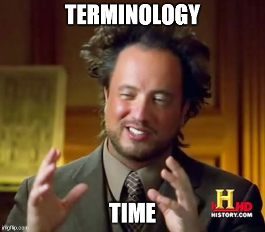
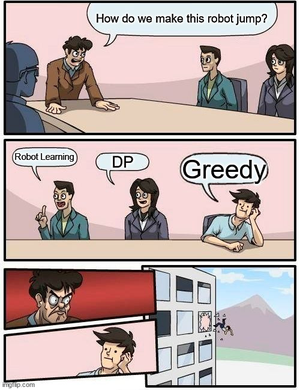

# Basics of Robot Learning
In the first subpart of the week, you were vaguely introduced to the concept of rewards. Here we will formally define what exactly are rewards, as well as some other key terminology related to Robot Learning.
  

## Key Terminology

<li><b>Timesteps</b> - Same as timesteps in PyBullet.</li>
<li><b>Agent</b> - From now on, we'll be calling our robot <b>agent</b>, as this is the technical term for whatever we our trying to train, in the field of robot learning. You can see an agent as the brain of the entire process, as it is the agent which decides what action to take based on the reward points, it gets. </li>
<li><b>Rewards</b> - A reward is a scalar feedback signal, in the form of a number Rt. This number indicates the reward that the agent will get at a timestep t. So, being in a good position will fetch positive reward, whereas a bad position will fetch negative reward. (There is no strict rule regarding reward formulation, and you can model it in any way you want.)
<li><b>Environment</b> - The surroundings of the agent, with which it interacts. </li>
<li><b>Observation</b> - As the agent interacts with its environment, it will be able to observe some things in the environment. It is on the basis of these observations combined with rewards, that the agent makes decisions. </li>
<li><b>Action</b> - The actions that the agent takes.
<li><b>State</b> - A structure which encapsulates the summary of the entire history of observations, rewards and actions. The agent generally takes actions based on this state.

## So what exactly is the goal in Robot Learning?
We want our robot to accomplish some task, and hence make sequential decisions. So to solve this problem of sequential decision making, we maximize the expected cumulative future reward for the agent. 
A thing to note here is that actions of the agent can have long term consequences, hence it won't be beneficial to use a greedy approach, because a greedy approach might look the best thing to do for short term rewards, but it might lead to leser overall reward.

 

## The Entire Process of Interaction
 

## Some More Terminology :)
<li><State Space - The entire set of all possible states, is called the state space.
<li>Action Space - The entire set of all possible actions, is called the action space.
<li> Policy - This can be seen as the agent's behaviour function, and is a mapping from the state space to action space. i.e. given a state, it will give as output, what action should be taken.
<li>Value function - A function which takes as input a state, and tells how good it is to be in this state. i.e. given a state, it will return a numeric number which indicates the total future reward we will get.
<li>Action Value function - A function which takes as input a state, and an action, and tells how good it is to take that action in this particular state.
<li>Model - Agent's representation of the environment. So the environment will be affected by the agent's actions and then the environment gives some observations to the agent, based on it's own model.

 
 

<b>To get more intuition about these things, you can go through the first 2 videos of the following playlist:
[RL Course by David Silver](https://www.youtube.com/playlist?list=PLqYmG7hTraZDM-OYHWgPebj2MfCFzFObQ) </b>
