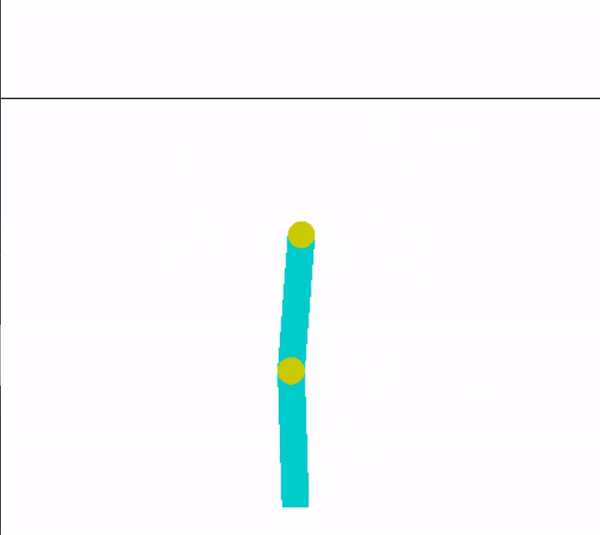
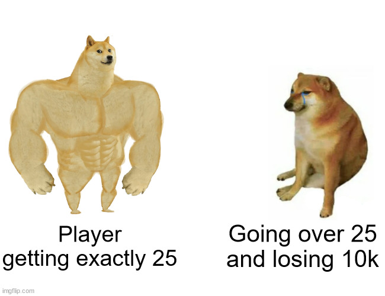

# OpenAI Gym
To solve any problem, you need to first formulate it well. You need to define the agent, the environment, what all will be included in the action space, state space, and what will be the rewards that the agent gives. And most of time in robotics, you will be maing custom environments, as these give you a lot of control over the problem, and how you want to solve it.

Gym, provided by OpenAI, is a python library that can be used for building your own custom environments for Robot Learning, as well as testing your own algorithms on inbuilt environments. These environments have the same structure, which is why you can easily write general algorithms, which work on any enviroment.

## Installing OpenAI Gym
The OpenAI Gym is very easy to install, you just need to run the following command on your terminal:
~~~bash
pip install gym
~~~
And that's it 😀! Now you can easily build environments for your robots to learn in.

## Getting started with Gym
~~~
import gym
env = gym.make('CartPole-v0')
env.reset()
for _ in range(1000):
    env.render()
    env.step(env.action_space.sample()) # take a random action
env.close()
~~~
Let us go through the above code, to make it clear, on how to use gym. This code is also available [here](https://gym.openai.com/docs/) along with a basic introduction on how to use gym.

Steps:
1. So here, we start of with importing gym, similar to all other libraries in python.
2. Then the next step, is to make an environment of your choice using the <b>gym.make</b> command. Note that these environments our inbuilt in Gym, and we'll look at how to make custom environments, in the next week. You can have a look at the different environments [here.](https://gym.openai.com/docs/) Here we have used the <b>CartPole Env.</b>
3. The reset function is used to reset the environment to it's original state, as if no action has taken place. This is required when the episode terminates. (Episode terminates only if the bot has accomplished a task, or done something which it is not supposed to do, e.g. if a quadruped falls down, while trying to learn how to walk).
4. Then we use a for loop, to run the agent in the environment. And in each iteration, we render the env, (to show the env in RealTime), and then do a step. This structure is very similar to what you have studied in PyBullet.
5. The env.action_space.sample, just takes out a sample action at random and feeds it into the env. This simulates a random agent doing actions in the environment. 
6. Close the environment.

 

Acrobot Environment in OpenAI Gym

## Different types of Spaces in Gym
To define the range in which your actions and observations can belong, and the type of these variables, i.e. continuous or discrete, needs to be defined in the environment, and gym provides Spaces, to deal with this efficiently.

Although there are many types of spaces, the two most important and widely-used spaces are:
 
<b>Box</b> - When you want to measure continuous values like maybe the joint angles, or apply actions which can be any real value,like -3.8787, then we use the Box space. It is used for defining continuous ranges.
It has two common use cases:
~~~Bash
Box(low=-1.0, high=3.0, shape=(3, 4), dtype=np.float32)
~~~
This defines a range of 12 variables, that can have any real value from -1 to 3, and the shape of this matrix will be a 3*4 matrix. Hence, all the values here will have the same range.
~~~Bash
Box(low=np.array([-1.0, -5.0]), high=np.array([3.0, 6.0]), dtype=np.float32)
~~~
This defines a space of two variables, the first variable having range from -1 to 3, and the second having range from -5 to 6. This is generally used, when the variables can have different ranges.
  
<b>Discrete</b> - Used for variables that have discrete value, e.g. directions, whether to go up, down, left or right.
~~~Bash
Discrete(5)
~~~
This will create a space, with 5 possible values, 0, 1, 2, 3, 4, all defining different values of that variable.

## Creating an Env
You can find the boilerplate code for creating an Env [here](./Env.py). This code has detailed instructions about how to create your own env, and the entire structure of the Environment.

## Task - Creating Your Own Environment
Let us introduce you to a card game known as RoboCards. RoboCards is a card game where the goal is to obtain cards that sum to as near as possible to 25 without going over.
 
The gameplay of the game is as follows:
<li> The player is playing against a fixed dealer.
<li> Face cards (Jack, Queen, King) have point value 10.
<li> Aces can either count as 11 or 1, and it's called 'RoboAce' at 11.
<li> This game is placed with an infinite deck (or with replacement).
<li> The game starts with dealer having one face up and one face down card, while player having two face up cards.
<li> The player can request additional cards until they decide to stop or exceed 25 (But note, exceeding 25 will result in a loss).
<li> After the player stops drawing cards from the deck, the dealer reveals their facedown card, and draws until their sum is 20 or greater.  If the dealer goes bust the player wins.
<li> If neither player nor dealer goes over 25, the outcome (win, lose, draw) is decided by whose sum is closer to 25.  <li> The reward for winning is +1, drawing is 0, and losing is -1.
  

The task for this part is to create an environment which simulates this process. The things which need to be completed are:
1. Defining an observation space, where the observation is a tuple of 3 discrete variables: the sum of the values of the cards for the player, the value of the card with the dealer having face up, and whether the player has a RoboAce. (While taking the sum of the values of the card, if the player has a Ace, and using it as RoboAce doesn't make the sum go over than 25, then you need to consider the Ace as 11 else 1, same goes for whether there is a RoboAce or not).
2. Defining an action space, which tells the player whether to draw a card, or stop.
3. Reward Function - which gives the reward to the player, as defined in the gameplay.
4. Implementing the step function by taking an action as argument, (action meaning draw or stop). If the player goes over 25, terminate the episode and give -1 reward, if the player stops, then while the total sum of the dealer's cards is less than 20, keep drawing cards for the dealer.
5. Function to get the observation from the environment.
6. Fuction to reset the environment. After reset, both the player and the dealer should have two cards at random.
7. A class which contains all these functions.

<b> Note: Every step mentioned above has points, and the total points will be the sum of the points for each part.</b>

Do feel free to contact us on the discord group, in case of any doubts!
