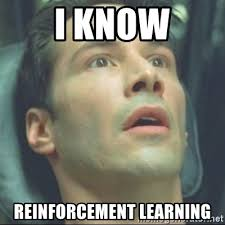

# Implementation of Robot Learning

As you must have realized by now, implementing complex algorithms can be quite a pain sometimes. It just leaves you wondering why there aren't libraries like [Keras](https://keras.io/) and [Tensorflow](https://www.tensorflow.org/) in regular Machine Learning, which make your lives so much simpler by abstracting away the nitty-gritties of implementation and lets you focus purely on the big picture. Fortunately, there are such libraries available as open-source, one of which is the [**Stable Baselines**](https://stable-baselines.readthedocs.io/en/master/) Package.

Stable Baselines is a godsend for people like us who work on RL problems quite frequently simply because it works so well across multiple environments, and is quite easy to get up and running. You may think of it as the equivalent of Keras in Reinforcement Learning.

All the popular RL algorithms like DQN, DDPG, PPO, TRPO and quite a few more are provided off the bat in this package, and it is quite simple to use as well.

The docs explain the package so much better than we ever could, so we encourage you to have a look [here](https://stable-baselines.readthedocs.io/en/master/).

## Your Task

Your task, should you choose to accept it, is to implement a control algorithm for the environment that you created in Week 2. We are aware that coding an algorithm from scratch will be difficult, therefore we encourage you to use the full power of Stable Baselines. You can implement any algorithm of your choice, but since you are familiar with DQNs, you can start there.

Make sure you use the policy of iterate and improve and keep tuning your hyperparameters to get the best possible result.

In conclusion, we must say that it was a pleasure to be a part of creating this camp, and we hope to see you spread your wings across new frontiers using this newfound knowledge.

We hope this is how you feel after this track of the camp.

